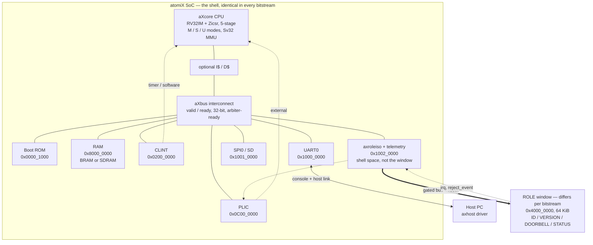
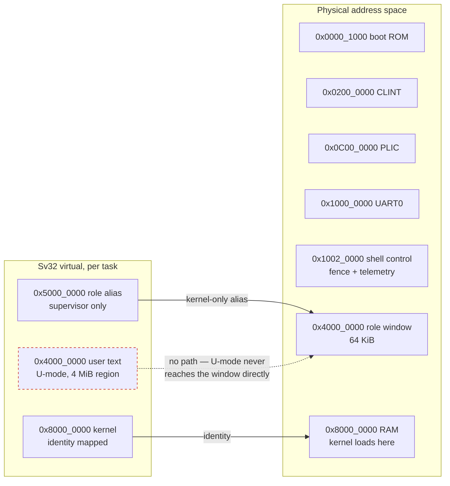
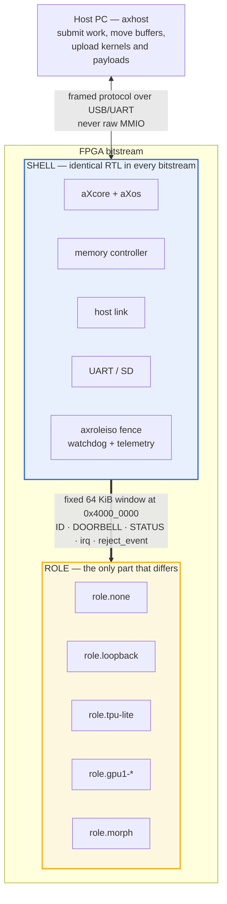
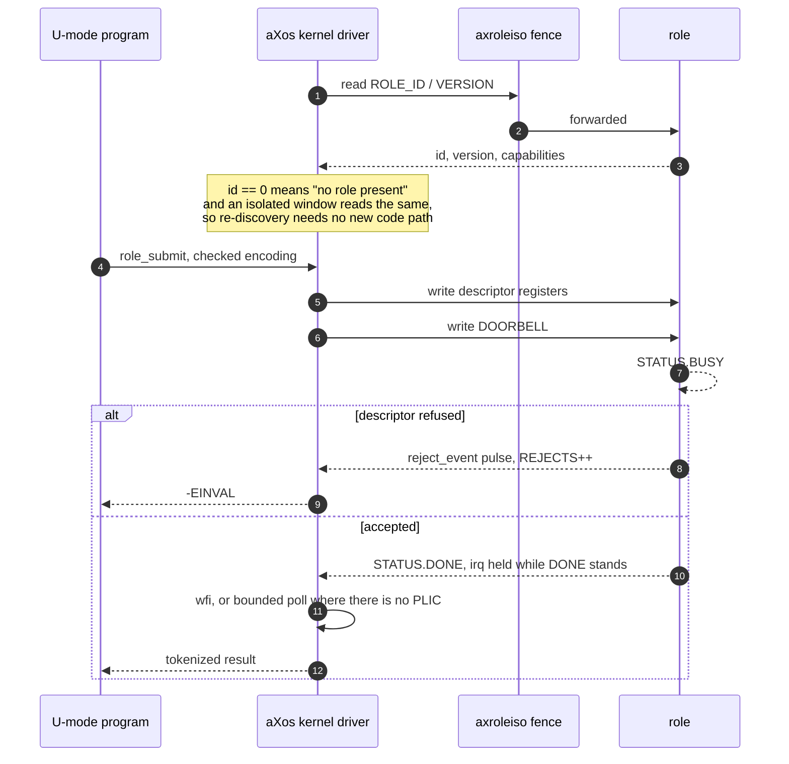
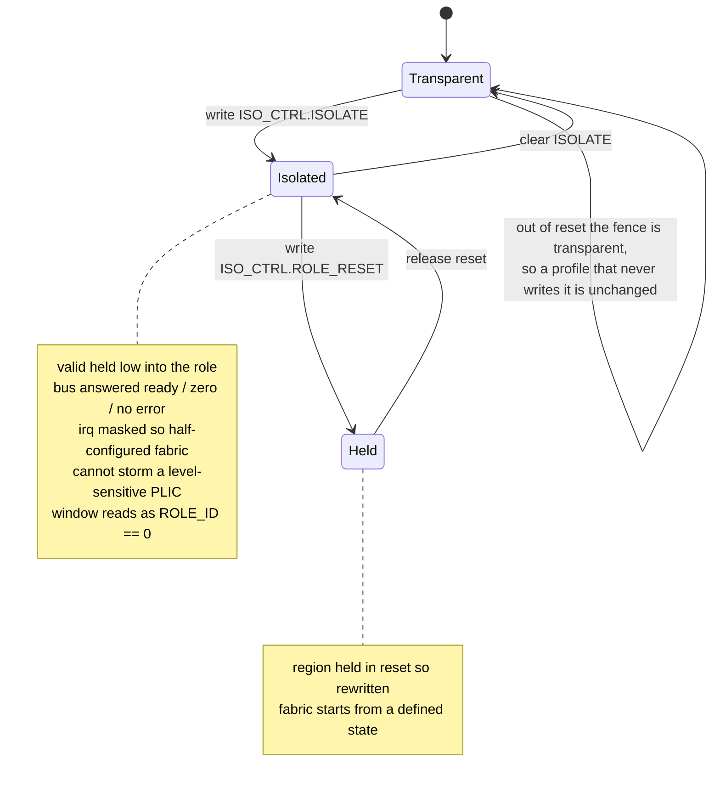
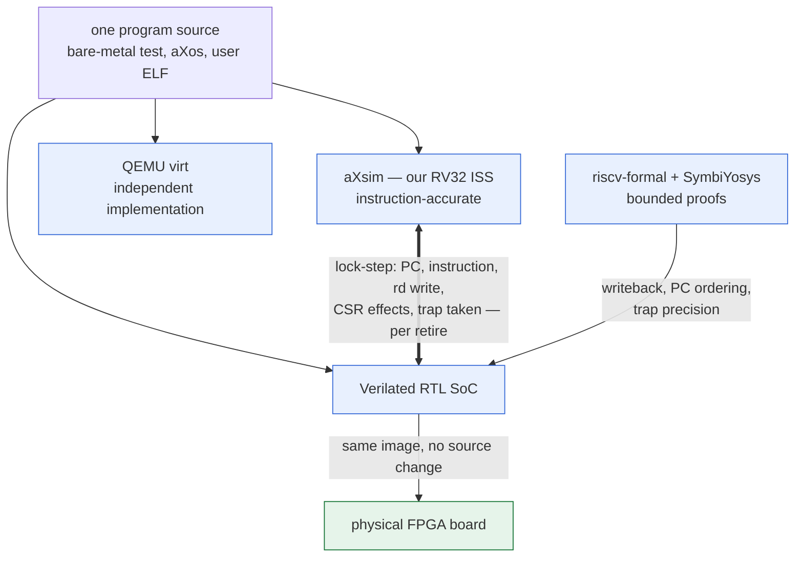
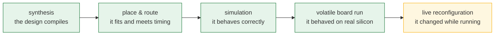

# atomiX — Design Document

A computer system built from scratch — CPU → SoC → kernel → OS — that grows
into a **reconfigurable FPGA accelerator platform**: one FPGA that can serve as
a CPU, a TPU-style matrix engine, or other roles, managed by our own kernel and
controlled from a host PC through our own driver. This document records the
closed design decisions and the phased plan. It is the contract for everything
we build.

## 1. Goals and non-goals

**Goals**

1. A RISC-V CPU and surrounding SoC (memory, bus, peripherals) written by us in
   synthesizable SystemVerilog.
2. Our own monolithic Unix-like kernel (xv6-inspired *scope*, not a copy) running
   on that SoC: processes, virtual memory, syscalls, a filesystem, a shell.
3. FPGA-portable from day one: every line of RTL obeys FPGA constraints
   (synchronous single-clock design, BRAM-shaped memories, no latches), targeting
   the open Yosys + nextpnr flow for Lattice ECP5.
4. "As close to actually working as possible": verified against a golden model,
   the official ISA tests, and formal proofs — not just demos that happen to run.
5. **A shell + role accelerator platform** (§3.3): the CPU + kernel become the
   permanent management plane ("shell") of the FPGA; swappable "roles" (first: a
   TPU-lite systolic array) attach as aXbus devices; a host-side driver controls
   the whole card over a host link. Goals 1–4 are unchanged — they *are* the
   shell.

**Non-goals (for now)**

- Multicore / cache coherency.
- Performance competitiveness — correctness and clarity win every tie.
- USB, Ethernet, or graphics in v1 (the v1 machine is headless over UART).
- ASIC considerations.

## 2. Decision record

| Decision | Choice | Key consequence |
|---|---|---|
| Build vs adopt | **Scratch-build only what teaches** (core, bus, kernel, roles); **adopt the industry standard everywhere else** (RISC-V ISA, stock GCC, ELF, riscv-tests, riscv-formal, Verilator, QEMU-`virt` map, 16550 UART, xv6 scope, Wishbone-adjacent bus) | Maximum support and knowledge base; our effort concentrates where the learning is |
| Languages | **Polyglot, right tool per layer**: C for target software (kernel, bare-metal, userland), C++ for host tooling (ISS/cosim — Verilator emits C++), Python for scripts | Cross-language conflicts are resolved at the boundary where they appear, case by case |
| ISA | RISC-V **RV32IM + Zicsr**, privileged spec M/S/U, **Sv32** MMU | Free GCC/LLVM/QEMU ecosystem; privileged spec is mandatory for the kernel goal |
| HDL | **SystemVerilog** (synthesizable subset supported by Yosys) | Verilator for fast sim; portable to any vendor flow |
| Microarchitecture | **Classic 5-stage pipeline from day one** (IF ID EX MEM WB) | Precise exceptions and hazard handling are designed in from the start, not retrofitted |
| Memory system | **BRAM first**, then delayed external-memory + I$/D$ caches and an x16 SDRAM controller | CPU↔memory already tolerates wait states, so the cache/controller slots in without core changes; physical proof is a board gate |
| Interconnect | **Custom minimal valid/ready bus**; Wishbone bridge later if we adopt third-party cores | We fully own and understand the "connectors" layer |
| Peripherals v1 | **UART console + CLINT (timer/software interrupts)**; PLIC, SD card, video later | Minimum viable for a preemptive kernel with a serial shell |
| FPGA target | **ULX3S v2/v3 85F (ECP5) / open flow** | Pin-constrained bitstream flow and SDRAM/UART PHY are checked in; P&R and physical proof remain explicit bring-up gates |
| Verification | **Own ISS golden model + lock-step cosim** in Verilator + **riscv-tests** + **riscv-formal** | Highest-confidence tier; the ISS doubles as a fast kernel-dev platform |
| Core memory ports | **Separate ibus + dbus masters** (Harvard at the core edge) | No structural hazards; caches later attach per-port with no core changes; SoC serves both from dual-port BRAM |
| Irregular instructions | **Serialize** CSR writes, `mret`, `fence.i` (later `div`): flush younger, complete alone, refetch | A few cycles on rare instructions buys away a whole class of in-flight side-effect hazards |
| Build order | **ISS first, then RTL** | RTL debugging starts with a trusted golden model and cosim from day one |
| Kernel | **Monolithic, xv6-inspired scope**, our own code | Achievable scope with a known-good reference for when we're stuck |
| Platform model | **Shell + role** (AWS F1 / Catapult style): aXcore + loader fixed in the FPGA image, aXos uploaded as the common management payload, role selected or programmed per mode | Kernel and FPGA lifecycles are independent; the host driver never sees role internals, only the shell protocol |
| Component composition | **Manifest-selected implementations with lenient stock seams** | Users may substitute CPU, SoC fabric, memory, peripherals, board/harness, software/kernel code, or aXos service policies; manifests compose sources but do not prescribe microarchitecture or verification claims |
| Mode switching | **Runtime-programmable role first**; cached full-bitstream swap only for a different physical datapath; live partial reconfiguration remains research | Normal kernel/benchmark iteration never runs synthesis or P&R; the resident shell loads accelerator programs in milliseconds |
| Kernel deployment | **Kernel is always a runtime payload** loaded by an immutable ROM; never a fabric-synthesis input in kernel profiles | aXos changes take a serial upload, not a new netlist, placement, route, or bitstream |
| Host link | **USB** — FTDI USB-serial first (~1–3 MB/s), soft USB device core later | Zero extra hardware on ULX3S-class boards; models as a virtual pipe in simulation |
| Role interface | **aXbus MMIO device with doorbell + descriptor ring** | Same idiom as real NVMe/GPU hardware; one driver model for every role |
| First role | **TPU-lite: int8 systolic GEMM array** on ECP5 DSP blocks | Most tractable "real" accelerator; clearly benchmarkable against host matmul |

## 3. System architecture



The fence is the load-bearing detail. `axroleiso` sits between the address
decoders and the role, and its control register is in **shell** space at
`0x1002_0000` rather than inside the window it fences — a register inside that
window would be unreachable at exactly the moment it is needed.

### 3.1 Platform compatibility rule

The memory map and peripheral programming models follow **QEMU's `virt`
machine** wherever we don't have a reason to differ. Payoff: every piece of
software we write (bare-metal tests, the kernel) runs on three platforms with
zero changes — our ISS, QEMU, and our RTL — which is how we isolate "software
bug" from "hardware bug".

### 3.2 Memory map (v1)

| Base | Size | Device |
|---|---|---|
| `0x0000_1000` | 4 KB | Boot ROM (BRAM, `$readmemh`-initialized) |
| `0x0010_0000` | 4 KB | Test finisher (QEMU `sifive_test`-compatible: `0x5555`=pass, `0x3333`\|code≪16=fail; simulation platforms only) |
| `0x0200_0000` | 64 KB | CLINT: `msip`, `mtimecmp`, `mtime` |
| `0x0C00_0000` | 4 MB | PLIC (reserved; implemented when we have >1 interrupt source) |
| `0x1000_0000` | 4 KB | UART0 (16550-compatible subset) |
| `0x1001_0000` | 4 KB | SPI0 (polling mode-0 controller for SD card) |
| `0x1002_0000` | 4 KB | Shell control: role-window isolation plus Live FPGA telemetry at offset `0x100`; in shell space, not the role window, because both must stay reachable while that window is being rewritten |
| `0x4000_0000` | 64 KB | Role window (`ROLE_ID`/`VERSION`/`DOORBELL`/`STATUS` header, then role-defined; `ROLE_ID` reads zero when no role is selected) |
| `0x8000_0000` | 128 KB → 32 MB | RAM (BRAM in v1; 32 MiB x16 SDRAM on ULX3S). Kernel loads at `0x8000_0000` |

Misaligned or unmapped accesses raise the appropriate precise exception; the
bus returns an error response rather than hanging.

Role-visible RAM windows (for descriptor rings in main memory) will be
assigned from remaining unused space when a role needs bus mastering.

The same physical role window is reachable at two different virtual addresses,
which is the part of this map most worth drawing:



User text keeps virtual `0x4000_0000` while aXos reaches the same physical
window through a supervisor-only alias at `0x5000_0000`. That is what lets a
U-mode program be linked at the natural base without ever being able to address
the accelerator: it submits checked jobs through `role_info` / `role_submit` /
`role_wait` instead, and the kernel copies the encoding.

### 3.3 Shell + role platform model

The endgame architecture. The FPGA design is split into two parts:



Everything a recovery path needs — the CPU, the loader, the UART, the fence
itself — is on the immutable side. That is what makes a role safe to replace:
the thing being changed is never the thing you would need in order to undo the
change.

- **Shell** = aXcore + aXos + aXbus + memory controller + host link + boot.
  Same source, present in every bitstream. This is where "the ISA is common"
  and "the kernel is common" are literally true: aXos always runs on the
  shell's RISC-V core, in every mode.
- **Role** = the mode-specific accelerator, attached to aXbus as an MMIO
  device in the fixed 64 KiB window at `0x4000_0000`: an ID register, a
  doorbell, a status register, and role-defined descriptor registers and
  windows, plus an interrupt line via PLIC when it exists. aXos discovers
  the role via `ROLE_ID`, feeds it work, and exposes it over the host link.

**The job cycle.** aXos discovers the role, submits work, and collects the
result; U-mode never touches MMIO.



**Isolation, and why it is unconditional.** Replacing a role means the window
may stop answering. The fence exists for exactly that moment:



Isolation is immediate and unconditional rather than waiting for in-flight
traffic to retire. The role it protects against is the one that has *stopped
answering*, so a fence that drains first deadlocks on the very failure it exists
to contain; quiescing stays the driver's job one level up.

**Writing your own role.** A role is one SystemVerilog module named `axrole`
plus a `components/role/<name>/component.json` naming its sources; selecting it
is a one-line change in a profile. The module's ports are the whole contract:

| Port | Direction | Meaning |
|---|---|---|
| `clk`, `rst` | in | `rst` is the shell's role reset, which the fence can assert on its own |
| `i_*`, `d_*` | aXbus slave | fetch and data ports for the 64 KiB window; the fetch port need only decode the register page |
| `irq` | out | level-sensitive completion, held while `STATUS.DONE` stands |
| `reject_event` | out | one-cycle pulse per descriptor or job the role refused, for Live FPGA telemetry |

`reject_event` exists only in builds that take the Live FPGA role-event
producers (`soc.live_role_events`, on by default), so guard it with
`` `ifdef AX_LIVE_ROLE_EVENTS `` exactly as the supplied roles do. Carrying the
line is mandatory; *reporting* on it is not — a role with no descriptor it can
refuse ties it low and says so, which is a statement about that role rather
than a gap in the shell. Copy `components/role/loopback/` as the smallest
complete example: it implements the full header, doorbell, status, and a
block-RAM-shaped buffer, and its component manifest shows how to declare
capabilities and tunable parameters.
  Under Sv32, aXos uses a supervisor-only `0x5000_0000` virtual alias for this
  physical aperture, leaving user text at virtual `0x4000_0000`; U-mode submits
  checked jobs through `role_info`/`role_submit`/`role_wait`, never raw MMIO.
  A role does **not** execute RISC-V; it consumes descriptors.  Roles are
  selectable `role` components; `role.none` (the default) makes discovery
  read zero, and `role.loopback` is the executable contract proof.
- **Mode switch** = three tiers.  (1) In simulation and at build time, a
  profile selects the fixed shell and role hardware once.  (2) In normal live
  use, a role's *function* changes by loading new programs/descriptors through
  its window — the way real GPUs and TPUs change behavior. `GPU_LOAD`, for
  example, replaces a nine-instruction program in about 0.46 ms on the Primer
  runtime profile's 921600-baud link while aXos stays alive. A prebuilt full SRAM bitstream reload
  remains the fallback for a genuinely different physical datapath and
  restarts the FPGA side; synthesis/P&R is never in the runtime loop.
  (3) Rewriting only the role region of a running
  bitstream — shell and aXos never stopping — is the
  partial-reconfiguration research track in
  [docs/partial-reconfig.md](docs/partial-reconfig.md). "Shell is fixed"
  means fixed at the source level — the same shell RTL in every build.
- **Software loading** is below the role protocol and applies to every payload,
  not only to aXos. The fixed FPGA image resets into a small ROM loader, which
  accepts a length-bounded, CRC-32-checked `AXK1` binary, writes it to blank
  RAM, executes `fence.i`, and jumps to `0x8000_0000`. The loader is
  deliberately payload-agnostic — it copies bytes and jumps — so an aXos
  personality, a bare-metal benchmark, and a game are the same kind of thing to
  it. **No software change may cause FPGA synthesis or P&R**, and no program may
  become part of a bitstream's identity: a board claim is about hardware, and a
  claim that names a program silently expires the next time the program
  changes. On block-RAM boards the flow *can* bake a payload into synthesis
  (`chparam -set RAM_INIT_FILE`), which couples the two — that path is reserved
  for first bring-up of a profile that has no loader image yet, and every use
  of it says so. SD boot remains a separate persistent-storage mode, not the
  development fast path.
- **The loader has to be cheaper than the coupling it removes.** It was not, at
  first: `axrom` read combinationally, and an asynchronous read cannot map to a
  Gowin BSRAM, so the 4 KiB boot ROM became a LUT ROM and the loader image cost
  about 1,534 LUT4 more than a baked one (15,425 against 13,891 on the same
  profile). A profile near the device limit then had a real reason to refuse
  the decoupling, which would have left the invariant true only where it was
  free. `axrom` now carries the same `SYNC_READ` parameter `axram` does, and the
  boards set it: the read and its completion are registered, the array infers
  BSRAM, and the ROM costs blocks instead of logic. It is a 0W2R memory, so the
  synthesiser maps both read ports onto the same two initialised blocks; the
  price is one wait state on ROM fetches, paid only while the loader itself is
  executing. Routed, the shipping `tangprimer25k-runtime` image goes from
  15,425 LUT4 / 36 BSRAM / 29.72 MHz to **13,387 / 38 / 31.21** — smaller and
  faster — and lands **457 LUT4 below the baked `cpu` image it replaces**. The
  decoupling is no longer something a tight profile has a reason to refuse; it
  is the cheaper option. It is not uniform, though: the 4-lane GPU pays 829
  LUT4 for its loader and the TPU pays 766 plus the ROM's 2 BSRAMs, which on
  that profile lands at 50 of 56 blocks alongside 24 multipliers. Everything
  fits; what runs out is *placement freedom*, since Gowin BSRAM and DSP columns
  are fixed. `runtime-tpu` legalises on one seed in five (FAIL/PASS/FAIL/FAIL/
  FAIL for seeds 1–5), so it pins `pnr_seed: 2`. Every Primer profile except
  `ax2` can therefore run the loader, and `ax2` is excluded by arithmetic
  rather than luck: 25,569 LUT4 against 23,040, with the 64-entry BTB alone
  costing 5,820 LUT-family cells because a predictor consulted at fetch time
  must read combinationally and so can never reach block RAM.
- **A boot ROM only earns block RAM on a machine that boots from it.** The
  registered ROM is scoped by `ROM_SYNC_READ = (RESET_PC == ROM_BASE)`, because
  a profile resetting into RAM has a baked payload and never fetches a ROM
  word. Left global, the registered form leaves a handshake behind in designs
  that never use it and re-rolls packing — erratically, −252 LUT4 on one
  profile and +427 on another — which was enough to push `role.tpu-lite` and
  `role.morph` off a legal placement while they sat at 78–87% utilisation. Two
  locked profiles went from placing to not placing because of a ROM neither of
  them reads. Scoping it restores both to bit-identical-to-HEAD while the
  loader profiles keep every gain. The general rule: a shared component's
  "better" implementation is only better where the component is used, and on an
  FPGA near its limit, structure moves placement even when it removes logic.
- **Host driver (`axhost`)** = userspace tool/daemon on the host PC speaking a
  small framed protocol over USB: bitstream upload, buffer read/write, work
  submission, completion events. It knows the shell protocol, never the role
  internals — role-specific logic lives in aXos and in per-role host libraries
  above `axhost`.
- **First role: TPU-lite (implemented, `role.tpu-lite`)** — an int8
  weight-stationary systolic GEMM engine: an 8×8 MAC grid holding the weight
  tile stationary, partial sums flowing down the columns through pipeline
  registers, activations entering through per-row skew delay lines, with
  32-bit accumulation, an accumulate mode (the K > 8 tiling primitive), and
  a ReLU output stage.  Chosen because a systolic array is the most
  tractable genuinely-real accelerator and offloaded matmul is trivially
  benchmarkable against the host CPU — `make -C sw/baremetal check-tpu`
  verifies three GEMM jobs against an on-core reference and prints both
  cycle counts (~210× on the reference machine's 32-cycle multiplier).
- **Second role: GPU-compute (implemented, `role.gpu-compute`)** — an 8-lane
  SIMT (Single Instruction, Multiple Threads) vector engine: software uploads
  a short straight-line kernel written in a small load/store + integer-ALU
  instruction set and a flat global data buffer, sets a thread count, and
  rings the doorbell.  Eight lanes execute the kernel in lockstep across
  ceil(threads/8) waves — each lane on its own thread index, over per-lane
  register files, with out-of-range threads in the last wave predicated off
  (the SIMT tail) and memory instructions serializing the lanes onto the
  buffer port (modeling memory-divergence cost).  It is the same
  doorbell/descriptor driver model as TPU-lite but *programmable* rather than
  fixed-function, which is exactly how a GPU differs from a systolic array.
  `make -C sw/baremetal check-gpu` verifies saxpy, fused multiply+ReLU, and a
  gather kernel against an on-core interpreter of the ISA and prints the
  role-versus-CPU cycle counts.
- **Resident composite: GPU-compute + TPU-lite (implemented,
  `role.gpu-tpu`)** — both hard engines remain instantiated behind one fixed
  role window.  Offsets `0xfff0`–`0xfff8` publish the composite ID, version,
  and GPU/TPU capability bits; `0xfffc` selects GPU (0) or TPU (1).  All other
  accesses go to the selected engine unchanged, including its native role ID
  and programming model, so the existing GPU and TPU drivers remain the
  semantic boundary.  The selector refuses a change while either engine is
  executing or has an uncleared completion, and neither engine is reset by a
  switch, so its local memories and counters remain resident.  The direct RTL
  check and `make -C sw/baremetal check-gpu-tpu` run both workloads, exercise
  refused switches, and verify retained GPU state.  The Tang Primer loader
  profile places and routes at 33.18 MHz, but has no physical-board result.
- **Scalable role family: gpu1 (implemented, `role.gpu1-{s,m,l,xl}`)** — the
  successor to the above, built to make lane count worth scaling.  The single
  global-buffer port is what capped the earlier engine: going from 8 to 16 lanes
  bought only 1.18×, because memory time is flat when one lane is serviced per
  cycle.  gpu1 splits the buffer into **NBANKS interleaved block RAMs behind a
  lane→bank crossbar**, so a coalesced access — lane L touching `base+L` — hits
  distinct banks and retires in one round.  Conflicts serialise lowest-lane-first
  per bank, which is precisely what leaves the highest lane as the last writer to
  a duplicated address and preserves the store order the oracle defines.  It also
  carries the control ISA the first engine lacked: structured per-lane divergence
  (IF/ELSE/ENDIF over a mask stack), uniform and any-lane branches, compare-set,
  integer divide, cross-lane shuffle, and displaced addressing — so kernels can
  branch and loop rather than being straight-line only.  Lanes, banks, and the optional ISA groups are
  build-time parameters of the one component; the geometry is published in a
  CAPS register so one driver and one oracle serve every setting.  Measured 1.69–1.82× per lane doubling
  and 2.70× the old engine at 16 lanes
  ([hardware-capabilities.md](docs/hardware-capabilities.md)).

Simulation story is unchanged: the host link models as a virtual pipe, so the
full stack — axhost on the real host, aXos on the simulated shell, role RTL —
runs end-to-end under Verilator before any hardware exists.
The exact fast-switch gate is `make -C sw/kernel check-primer-runtime`: one
resident 32 KiB aXos image loads and runs SAXPY, replaces the GPU microcode with
a polynomial kernel, runs again, and verifies both host-side references without
restarting the model.

## 4. CPU: `aXcore`

The `axcore` boundary carries three core families, and which one a profile
selects is a capability-versus-area decision, not a correctness one:

| family | shape | privilege | evidence |
|---|---|---|---|
| `core.pipeline5` | 5-stage scalar | M/S/U + Sv32 | cosim, riscv-formal, ISA suite |
| `core.ax2` | 3-stage, dual-issue, I$ + BTB (tunable) | M only, physical | ISA suite on RTL |
| `core.minimal` | multi-cycle | M only, physical | directed + suite |

Sizes inside a family are build-time parameters, not separate components: a
component is the unit of architecture, so a different pipeline or privilege
model earns one and a different cache size does not.  See
[workflow.md](docs/workflow.md) §3.4a.

`core.pipeline5` remains **the reference**: it is the only one with the MMU and
the only one carrying lock-step cosimulation and formal evidence, and the
architectural contract in §4.1–4.3 describes it.  `core.ax2` is the
performance core (§4.4); `core.minimal` is the area-minimal accelerator host.

### 4.1 ISA profile and scope

The reference core implements RV32IM + Zicsr, precise synchronous traps,
machine/supervisor/user modes, CLINT interrupts, Sv32 page tables and TLB,
`sfence.vma`, SUM/MXR handling, and delegation through `medeleg`/`mideleg`.
Multiply and divide use a fixed-latency unit that stalls EX.

The C extension remains deliberately out of scope because it complicates
fetch alignment without enabling the current system goals.  The A extension is
also out of scope for the single-hart design; kernel critical sections disable
interrupts.  Revisit either only when a concrete enabling need exists.

The portable baseline is `-march=rv32im -mabi=ilp32`.  Newer toolchains may
use the explicit `rv32im_zicsr` spelling; Ubuntu 22.04 GCC 10 accepts CSR
instructions through the compatible `rv32im` spelling.

### 4.2 Pipeline

Classic 5 stages: **IF → ID → EX → MEM → WB**.

- **Hazards:** full forwarding (EX/MEM and MEM/WB → EX); one-cycle load-use
  stall; branches resolved in EX with static not-taken prediction (2-cycle
  taken-branch penalty). No branch predictor in v1 — the interface leaves room
  for one later.
- **Stalls:** IF and MEM issue requests on the bus with valid/ready; any
  wait-state stalls the pipeline upstream. This is the provision that lets
  BRAM (1-cycle) be swapped for caches+SDRAM (variable) without touching the
  core.
- **Precise exceptions — designed in, not bolted on:** every instruction
  carries its PC and an exception tag down the pipeline. Faults mark the
  instruction and travel to a single commit point (MEM/WB boundary) where the
  trap is taken: younger in-flight instructions are flushed, `mepc`/`mcause`/
  `mtval` are written, and fetch redirects to `mtvec`. Interrupts are injected
  at the same commit point so they are precise too.
- **Memory ports:** the core exposes two independent aXbus masters — `ibus`
  (fetch, from IF) and `dbus` (loads/stores, from MEM). Harvard at the core
  edge, unified behind it: the v1 SoC serves both from dual-port BRAM; later,
  I$ and D$ attach one per port with no core changes. Fetch and data access
  never contend, so the pipeline has no structural hazards.
- **Register file:** 32×32 flip-flops, x0 hardwired to zero, 2 read ports +
  1 write port, with an internal write-before-read bypass so an instruction
  in ID sees the value WB writes in the same cycle (the forwarding path
  people forget).
- **Irregular instructions are serialized:** CSR writes, `mret`, and `fence.i`
  (later: divide) execute alone — younger instructions are flushed, the
  instruction completes, fetch restarts after it. Rare-instruction cycles
  traded for the elimination of in-flight side-effect hazards; no CSR
  forwarding network exists or needs verifying.
- **CSR file:** its own module, accessed in EX under the serialization rule.
- **`FENCE`:** no extra hardware action in the single-hart write-through
  cache design. **`FENCE.I`:** serializes in the core and, when the selected
  profile enables caches, retires a registered I-cache invalidation before
  refetch.
  **`WFI`:** executes as a nop in v1.

### 4.3 Correctness definition

The core is correct when it (a) passes all rv32ui/rv32mi/rv32si riscv-tests,
(b) retires lock-step-identical to the ISS over long randomized programs, and
(c) passes riscv-formal's bounded checks. All three, not any one.

### 4.4 Performance family: `core.ax2`

A dual-issue in-order superscalar built for throughput rather than coverage.
Pipeline is **F → D → X**, three stages:

- **F** — `ax2_icache`: a direct-mapped instruction cache with 4-word lines,
  plus a branch-target buffer, and it owns the fetch pointer.  The cache is not
  a latency optimisation, it is the enabling structure: the aXbus fetch port is
  32 bits wide, so a core fetching straight off the bus cannot sustain more than
  one instruction per cycle however wide its back end is.  A line hit reads four
  words out of one block RAM and hands the pipeline the two at the fetch PC.
  The BTB is consulted in the same cycle as the cache index, which is what lets
  a correct prediction cost zero cycles rather than a bubble.
- **D** — decode both slots, read four operands, decide whether slot 1 may
  issue alongside slot 0.
- **X** — execute both, drive the data bus, resolve the branch, take traps,
  write back.  Multi-cycle work (loads, stores, mul/div) holds the bundle here.

Three stages rather than five is deliberate.  Because the register file is
write-first and writeback happens in the same cycle D captures operands, the
register file *is* the forwarding path — there is no forwarding network — and a
branch mispredict costs two cycles instead of four.  The cost is a longer X
stage, which is the right trade at these FPGA clock rates.

Slot 1 is refused (and re-presented as the next bundle's slot 0) when it reads a
register slot 0 writes, when both slots want the single data port or the single
mul/div unit, when slot 0 is a control transfer, or when either slot is a CSR,
system, or illegal instruction.  That last rule is what keeps every trap and
every CSR side effect precise without a second commit path.

Scope is machine mode with physical addressing: no Sv32, no S/U, no RVFI.  So
§4.3's definition of correctness cannot be met in full — (b) and (c) need the
RVFI surface — and ax2's evidence is (a) instead, the official rv32ui and
rv32um binaries executed on the RTL across every tier and wait-state setting.
A profile that needs virtual memory or the formal guarantee selects
`core.pipeline5`; a profile that needs throughput on bare metal selects ax2.

## 5. Interconnect: `aXbus`

Minimal synchronous request/response bus, single outstanding transaction:

```
master → slave:  valid, addr[31:0], wdata[31:0], wstrb[3:0] (0000 = read)
slave  → master: ready, rdata[31:0], err
```

- Transaction completes on `valid && ready`. Slaves may hold `ready` low
  (wait states) — CPU stalls, which is exactly the cache/SDRAM provision.
- `err` on decode miss or slave fault → precise access-fault exception.
- Address decode in a top-level `aXbus_mux`; one master today, arbiter slot
  reserved for a future DMA/debug master.
- **Wishbone posture:** aXbus is deliberately a near-subset of Wishbone
  classic; a bridge is a thin adapter if/when we import third-party cores.

## 6. Verification strategy (three legs)

1. **`aXsim` — our own RV32 ISS** (C++ or Rust — see open questions), written
   *first*, before any RTL. Instruction-accurate, models the same memory map,
   CSRs, and Sv32. Runs riscv-tests itself to establish trust. Doubles as the
   fast kernel-development platform.
2. **Lock-step cosimulation:** Verilator wraps the RTL; on every retired
   instruction the testbench compares (PC, instruction, rd write, CSR effects,
   trap taken) against `aXsim`. Divergence dumps waveform + ISS trace at the
   exact instruction. Fed by riscv-tests, directed tests, and a random
   instruction generator.
3. **riscv-formal + SymbiYosys:** bounded formal proofs of the pipeline
   (register writeback correctness, PC ordering, trap precision).



The same software running unchanged on three platforms is what separates
"software bug" from "hardware bug": a test that fails on the RTL and passes on
both the ISS and QEMU is pointing at the hardware, and one that fails on all
three is pointing at itself.  QEMU matters precisely because it is not ours —
agreeing with an implementation we did not write is evidence our memory map and
programming models are the standard ones rather than self-consistent.

**Evidence levels are never merged.**  A reviewer should read every claim in
this repository as belonging to exactly one of these, and the words are used
strictly:



Never call a result `verified`, `adaptive`, `partial`, or `live` when it only
demonstrates the level to its left.  The recommended automation policy is to run
simulation legs on every relevant change and formal jobs on core/RVFI changes.
The reproducible commands and current evidence are in
[docs/workflow.md](docs/workflow.md) and
[docs/design-checklist.md](docs/design-checklist.md).

## 7. Software stack

- **Toolchain:** stock `riscv64-unknown-elf-gcc` (multilib rv32) — no custom
  compiler work.
- **Bare metal:** crt0, linker script, MMIO helpers, timer/preemption, and SD
  bring-up programs are checked across ISS, QEMU, and RTL.
- **Kernel (`aXos`):** monolithic and xv6-inspired in scope: Sv32, trap
  handling, tasks, selectable scheduling/VM/storage policies, a resident
  shell, and SD boot/storage paths.  It is developed against aXsim/QEMU in
  parallel with RTL under the platform-compatibility rule (§3.1).
- **Future user and host software:** separately linked userland and `axhost`
  begin only when their executable-loader and host-link contracts are defined.

## 8. Engineering status and next work

The reference CPU, SoC, kernel, memory/storage path, component composition,
and simulation/formal verification infrastructure are complete to their
current contracts.  The live, command-backed status is maintained in
[docs/design-checklist.md](docs/design-checklist.md), rather than duplicating
a phase ledger here.

The role contract, its loopback proof, and two real accelerators are in
place (`role` components, `make -C sw/baremetal check-role`, `check-tpu`, and
`check-gpu`): TPU-lite (fixed-function systolic GEMM) and GPU-compute (a
programmable SIMT vector engine), both behind the same descriptor driver
model.  aXos now also owns an **in-kernel role driver**: the role window is
device-mapped into the kernel's S-mode address space, and the resident shell's
`role` command discovers and drives the accelerator from the management kernel
itself rather than a bare-metal program (`make -C sw/kernel
check-role-driver`) — the first piece of the shell control plane.  On top of
that driver sits the **host plane**, now working end-to-end in simulation: a
framed request/response protocol ([docs/host-protocol.md](docs/host-protocol.md)),
an aXos host-link service that dispatches host requests to the role driver, and
the host-side `axhost` — a host PC discovers the role and runs a job on it over
the link, through a virtual-pipe transport that models the console byte pipe.
The host plane now drives **all three real accelerators** with per-role opcodes
on that same frame format — `TPU_GEMM` and `GPU_RUN` alongside the loopback
`ROLE_RUN`, backed by in-kernel TPU-lite and GPU-compute drivers, each checked
against a host-side reference (`make -C sw/kernel check-hostlink`).  The
same checked encodings are now available to local U-mode programs through the
tokenized role ABI (`make -C sw/kernel check-role-driver`), while the driver
retains bounded polling behind a submit/wait boundary ready for PLIC-backed
completion. The remaining platform work enhances this base: a dedicated
USB-serial channel so a
console and the host daemon coexist (with the board gate), buffer/stream and
asynchronous-completion ops, and bitstream-upload mode switching.  ECP5 place-and-route and physical ULX3S
bring-up remain the final gate: they do not block simulation or component work,
but no physical-hardware claim is made before their evidence is recorded.

## 9. Repository layout

```
atomiX/
├── DESIGN.md            # this document
├── docs/                # per-block specs as they solidify (bus, CSR map, …)
├── components/          # selectable manifests and owned RTL/service sources
├── configs/             # reproducible component selections for sim/boards
├── tools/               # dependency-free configuration resolver
├── rtl/
│   ├── core/            # CPU architecture signpost -> components/core/
│   ├── soc/             # SoC architecture signpost -> component owners
│   ├── roles/           # future role design area
│   └── fpga/            # generic ECP5 flow; board sources live in components/
├── sim/
│   ├── axsim/           # the ISS golden model
│   ├── cosim/           # Verilator harness, lock-step checker
│   ├── soc/             # generic complete-SoC runner
│   └── testgen/         # random instruction generator
├── formal/              # riscv-formal glue + SymbiYosys configs
├── sw/
│   ├── baremetal/       # crt0, linker scripts, bring-up programs
│   ├── kernel/          # aXos orchestration; services selected from components/
│   ├── user/            # future separately linked userland
│   └── host/            # future axhost driver/daemon + role libraries
└── tests/               # riscv-tests submodule + directed tests
```

## 10. Deferred design decisions

1. **License:** choose the repository license before external distribution.
2. **Host link:** define USB-serial framing, flow control, failure recovery,
   and whether bitstream upload shares the transport or uses the FTDI JTAG
   path.
3. **Role interface:** allocate the role MMIO region and descriptor format,
   including doorbell and completion semantics (polling versus PLIC).
4. **UART compatibility depth:** retain the current 16550-style subset or
   expand it only when a concrete software compatibility need appears.

Physical-board observations are not an open design question: they are the
separate final evidence gate in [docs/design-checklist.md](docs/design-checklist.md).
