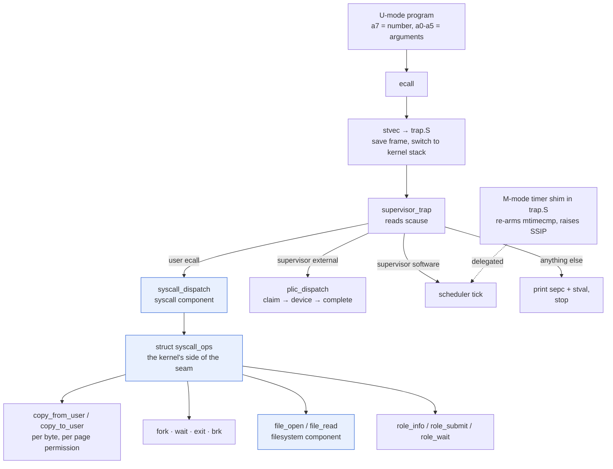

# aXos userspace ABI

The contract between a user program and aXos: how a program is loaded, what
state it starts in, and how it asks the kernel for something.

## The decision, and why

**Follow the RISC-V Linux ABI where one exists.  Make every layer of it
replaceable.**

There is no interesting originality available in syscall numbering, and a great
deal of value in not needing any: a standard ABI means an unmodified newlib or
picolibc can be retargeted onto it, an unmodified cross-compiler emits correct
code, and a program written for it is not written for atomiX alone.  Inventing
numbers would cost a libc port and buy nothing.

That is a default, not a constraint.  The syscall table is a selectable
component, the numbers and the dispatch live in one place, and there is a
reserved range for calls that have no Linux equivalent.  Someone who wants a
different ABI writes a different `syscall` component and keeps the loader, the
allocator, and the filesystem.  The point of the standard here is that you
should not *have* to think about it, not that you may not.

## Calling convention

Unchanged from the RISC-V Linux convention, which the existing kernel already
follows:

| register | role |
|---|---|
| `a7` | syscall number |
| `a0`–`a5` | arguments 1–6 |
| `a0` | return value |

A program executes `ecall` from U-mode.  The kernel resumes it at `sepc + 4`.

**Errors are negative return values**, `-errno`, exactly as Linux does it: a
return in `[-4095, -1]` is an error, anything else is a result.  This is what
lets a libc wrapper be the standard three-line "negate into errno, return -1"
shim rather than something atomiX-specific.

Registers other than `a0` are preserved across a syscall.  The kernel saves and
restores the full user register file, so a program need not treat `ecall` as a
clobbering call.

## Syscall numbers

From `asm-generic/unistd.h`, which is the table RISC-V Linux uses.  These
numbers are not ours to choose and are listed here only so the contract is
readable in one place.

| number | call | notes |
|---|---|---|
| 56 | `openat` | RISC-V has no `open`; `AT_FDCWD` is -100 |
| 57 | `close` | |
| 62 | `lseek` | on 32-bit this number is `llseek`; see below |
| 63 | `read` | |
| 64 | `write` | fds 1 and 2 reach the console |
| 80 | `fstat` | asm-generic 32-bit `struct stat`, 80 bytes |
| 93 | `exit` | |
| 172 | `getpid` | |
| 214 | `brk` | the heap `malloc` grows; bounded below by the heap start |
| 220 | `clone` | RISC-V has no `fork`; `clone` with SIGCHLD is fork |
| 260 | `wait4` | |

Two of these correct existing deviations.  The current kernel has `SYS_FORK = 1`
and `SYS_WAIT = 4`, which are neither Linux numbers nor Linux semantics; the
RISC-V ABI has no `fork` or `wait` at all, only `clone` and `wait4`.  The
migration keeps the behaviour and changes the number and the signature.

`SYS_CONSOLE_PUTC = 2` disappears entirely: it is `write(1, &c, 1)`.

`clone` is fork-shaped only: a non-zero stack pointer is `-EINVAL`, because a
thread model does not exist here and silently treating the request as a fork
would be worse than refusing it.  The child gets a **private copy of every page
the parent owns** — text, rodata, data, bss, heap and stack — so no write on
either side is visible to the other.  Pages that are mapped but not owned stay
shared, which is what ownership records.  Copying is eager: there is no
copy-on-write, so a fork costs as many pages as the parent has mapped, and
`clone` returns `-ENOMEM` when they are not available and `-EAGAIN` when the
task table is full.  Neither condition stops the machine.

### Reserved range for atomiX calls

`0x1000` and above is private and will never collide with the asm-generic table.
It is where calls that genuinely have no Linux equivalent go — the first being
the accelerator role driver, which is the whole reason this machine is
interesting and has no business being disguised as an `ioctl`:

| number | call | notes |
|---|---|---|
| 0x1000 | `role_info` | discover the role: id, version, capability word |
| 0x1001 | `role_submit` | submit one checked encoded accelerator job |
| 0x1002 | `role_wait` | collect a tokenized job result |

These are ours to define and to change.  Anything in the standard range is not.

## How a call reaches the kernel

Two controllers reach aXos by different routes, because RISC-V lets only one of
them be delegated. The machine timer is M-mode state that cannot be delegated,
so a small M-mode shim re-arms it and raises a delegated `SSIP`; device
interrupts need no shim, because the PLIC has a supervisor context and
`mideleg` bit 9 delegates them directly.



The seam is `struct syscall_ops`: the syscall component decides what a number
means and what error convention applies, while the kernel keeps owning the
trap. That is why replacing the ABI does not mean reimplementing the kernel —
and why `sstatus.SUM` stays clear and every user pointer goes through
`vm_translate_user`, so `-EFAULT` is enforced by the MMU rather than hoped for.

## Program loading

**ELF32, little-endian, RISC-V**, loaded directly rather than pre-flattened.
The same reasoning: it is what the toolchain already emits, it carries the
segment permissions the loader needs to map pages correctly, and a flat image
would need a bespoke header that every tool would have to learn.

The loader walks `PT_LOAD` program headers, maps each at its virtual address
with its `p_flags` permissions, zeroes the `.bss` gap between `p_filesz` and
`p_memsz`, and enters at `e_entry`.

**W^X is enforced on the image, not merely expected of it.**  A `PT_LOAD` that
is both writable and executable is rejected with `LOADER_EBADIMAGE` rather than
mapped, which keeps `perms_of` a translation of `p_flags` rather than a policy
decision: the loader never produces a user page it would not be willing to
defend.  Nothing a static toolchain emits needs W+X, so this costs a conforming
image nothing.

A linking note that is easy to get wrong, because it fails silently.  Aligning
sections to a page in a linker script does **not** give them separate
permissions: `ld` assigns sections to segments by flag compatibility, so
`.rodata` (`A`) is compatible with `.text` (`AX`) and lands in the same `R+E`
segment — mapped **executable**, with the page alignment buying nothing.  A
segment, not a page, is the unit the loader takes permissions from, so an image
that wants three permission sets must declare three segments.
`sw/kernel/userprog/user.ld` does this with an explicit `PHDRS` block, and
`check_boot.py` asserts the resulting layout is `R+X`, `R`, `R+W`, because every
behavioural test passes either way: an executable `.rodata` reads exactly like a
read-only one.

This pins a pairing: mapping pages needs S/U modes and Sv32, so a profile that
hosts programs selects **`core.pipeline5`**.  `core.ax2` is machine-mode only
and cannot host userspace — it is the bare-metal and accelerator-host core.
That constraint is real and worth stating plainly rather than discovering later.

### `brk` bounds

`brk` reports failure by returning the break **unchanged**, never by an errno,
and `brk(0)` is the query — a libc's `sbrk` is written against exactly that.
The break moves between two bounds and both are enforced: it may not grow past
`brk_limit`, one guard page below the stack, and it may not shrink below the
heap's start, the page after the loaded image. The lower bound is not a
formality: the shrink path unmaps and frees every page it walks, so a `brk` to a
low address would otherwise unmap the program's own text and fault it on the
next instruction fetch. A forked child inherits both bounds along with the
address space they describe.

## Initial process state

At `e_entry` the program sees the standard System V layout, because that is what
a libc's `_start` already expects:

```
sp -> argc
      argv[0..argc-1]
      NULL
      envp[0..n-1]
      NULL
      auxv (AT_PAGESZ, AT_PHDR, AT_PHENT, AT_PHNUM, AT_ENTRY, AT_NULL)
```

`sp` is 16-byte aligned.  All other registers are zero — notably, nothing is
passed in registers, so a program must not read `a0` at entry.

## Errno

The subset the initial calls can return, with Linux values:

| value | name | when |
|---|---|---|
| 1 | `EPERM` | operation not permitted |
| 2 | `ENOENT` | no such file |
| 5 | `EIO` | the block device failed a read |
| 9 | `EBADF` | bad file descriptor |
| 10 | `ECHILD` | `wait4` with no living children |
| 11 | `EAGAIN` | no free task slot for `clone` |
| 12 | `ENOMEM` | out of memory |
| 14 | `EFAULT` | bad address from userspace |
| 16 | `EBUSY` | the role already has an uncollected completion |
| 19 | `ENODEV` | the requested role operation is not present |
| 22 | `EINVAL` | invalid argument |
| 24 | `EMFILE` | descriptor table full |
| 30 | `EROFS` | write access to a read-only volume |
| 36 | `ENAMETOOLONG` | path longer than `path_max` |
| 38 | `ENOSYS` | syscall not implemented |
| 90 | `EMSGSIZE` | role request or response buffer is too small |
| 110 | `ETIMEDOUT` | the role did not complete within the driver bound |

`ENOSYS` is the honest answer for every number the table does not carry, and a
libc will do the right thing with it.

## What is tweakable

| layer | how |
|---|---|
| syscall table and dispatch | the `syscall` component; write another to define a different ABI |
| descriptor count, path length, I/O chunk, write size, role payload size | parameters on that component |
| the on-disk format and the diskless root | the `filesystem` component |
| private calls | the `0x1000+` range |
| loader input format | the `loader` component, if a flat image is wanted after all |

The parameters are declared in the component manifest and overridden per profile
by name, like every other tunable in the tree (see
[workflow.md](workflow.md) §3.4a).

## Files

A program opens a name, reads byte ranges from it, seeks within it, and asks
how big it is.  That is the whole of it, and it is enough for a program to
*read a file* -- the one thing the original evidence bar asked for that the
loader and the C library together could not do.

**Descriptors start at 3.**  0, 1 and 2 are the console and are never table
entries; `close` on one succeeds and does nothing, because the console is not a
file and cannot be reopened, and returning `-EBADF` would break the ordinary
libc shutdown path to make a point no program benefits from.

**The volume is read-only through the ABI.**  `openat` with any access mode
other than `O_RDONLY` returns `-EROFS`, even on a writable AXFS card.  This is
not a policy choice about permissions: the filesystem seam replaces a whole
file at a time (`fs_write(name, data)`) and has no "write through a descriptor"
operation, so accepting `O_WRONLY` would hand back a descriptor that must fail
on first use.  `-EROFS` at open is the answer a program can act on.  Writable
descriptors need `fs_write` to become an offset-and-length call first.

**`lseek` is `llseek`.**  Number 62 on 32-bit RISC-V takes the offset as a
register pair and returns the new position through a 64-bit out-parameter, with
0 in `a0` -- five arguments, not three:

```
a0 = fd, a1 = offset_high, a2 = offset_low, a3 = uint64_t *result, a4 = whence
```

This is exactly the sort of detail that following a standard is *for*.  A
32-bit `lseek` returning the offset in `a0` would be simpler and would work
perfectly with the libc in this tree -- and would silently fail with any real
rv32 libc, which emits the call above.  Collapsing it to a 32-bit offset is the
libc wrapper's job, and `libc.axlibc` does exactly that in eight lines.

**`fstat` fills the asm-generic 32-bit `struct stat`**: 80 bytes, `st_size` at
offset 32, `st_mode` at 8, `st_blksize` at 36, `st_blocks` at 44.  Fields this
system does not record -- device, inode, owner, timestamps -- report zero, which
is honest for a filesystem that has never had them.  A regular file reports
`S_IFREG | 0444`; a console descriptor reports `S_IFCHR | 0666`, which is what a
libc checks to decide whether to line-buffer.

**Descriptor tables are per task.** The syscall component owns one table for
each stable kernel task slot. A fresh root process starts with an empty table;
`clone` copies the parent's descriptors and offsets into the child's table, and
reaping resets the released slot. This gives processes independent descriptor
lifetimes. A future full POSIX open-file-description layer should make cloned
descriptors share offsets; today the copied offsets advance independently.

## Accelerator roles

Userspace never maps physical role MMIO. The kernel maps the physical
`0x4000_0000` aperture through its supervisor-only `0x5000_0000` alias and
offers three explicit calls:

```c
struct ax_role_info {
    uint32_t id;
    uint32_t version;
    uint32_t capabilities;
};

int role_info(struct ax_role_info *out);
long role_submit(uint32_t op, const void *request, size_t request_len);
ssize_t role_wait(uint32_t token, void *response, size_t capacity);
```

`role_info` succeeds with three zero words when no role exists. This includes
ISS and QEMU, which have no decoded role aperture at all: a bounded boot-time
probe converts that decode fault into absence. Known IDs and capability bits
are:

| role | id | capability |
|---|---:|---:|
| loopback | `0x4c4f4f50` (`LOOP`) | bit 0 |
| TPU-lite | `0x5450554c` (`TPUL`) | bit 1 |
| GPU-compute | `0x47505543` (`GPUC`) | bit 2 |

`role_submit` copies at most 1280 request bytes into kernel memory, validates
the role-specific dimensions, drives the descriptor/doorbell/status cycle, and
returns a positive token. The job encodings are the same little-endian
payloads used by the host protocol:

| op | request | response |
|---:|---|---|
| `0x10` | `words`(u16) · `words`×u32, at most 62 words | copied u32 words |
| `0x11` | `m`(u8) · `ctrl`(u8) · `W`[64 i8] · `A`[8·m i8], `1 <= m <= 32` | `C`[m·8 i32] |
| `0x12` | `nthreads`(u16) · `ninsn`(u16) · `ndata`(u16) · program and data u32 arrays | returned data u32 array |

GPU requests are capped at 64 instructions and 200 data words. Invalid
encodings return `EINVAL`; an op that does not match the installed role returns
`ENODEV`.

`role_wait` copies the saved result and returns its byte count. A wrong token,
a token owned by another task, or a second wait returns `EINVAL`. A short or
bad output buffer returns `EMSGSIZE` or `EFAULT` without consuming the
completion, so the owner can retry. Only one completion may be outstanding
because the physical role accepts one job at a time; another submit returns
`EBUSY`, and task teardown discards an uncollected result.

The hardware driver polls today, so device work has completed by the time
`role_submit` returns. The split submit/wait contract is intentional: adding a
role interrupt and PLIC can make completion asynchronous without changing
userspace. Polling is bounded meanwhile, so a wedged device returns
`ETIMEDOUT` instead of wedging the kernel.

### Where the files come from when there is no disk

The filesystem component mounts the SD card, and presents a small built-in
read-only root when no card answers.  Every profile that boots from RAM has no
card, so without this the question "can a program read a file" would be
answerable only on the storage platforms.  The fallback lives in the filesystem
component rather than in the shell -- which is where an equivalent table used to
live -- so `ls`, `cat`, and `openat` all go through one lookup and one read path
whether or not there is hardware behind it.  It is read-only because a root with
no device behind it cannot honestly accept a write.

## Deliberate omissions

Not in the first ABI, each for a reason rather than by oversight:

- **Signals.** A large mechanism whose absence a freestanding program does not
  notice.  `wait4` reports exit status without them.
- **`mmap`.** `brk` is enough for `malloc`; `mmap` matters when there is dynamic
  linking or file mapping, and there is neither yet.
- **Threads.** `clone` is present only in its fork-shaped form.  Real thread
  support needs a scheduler contract that does not exist.
- **`ioctl`.** The escape hatch that ABIs go to die in.  Accelerator access is
  an explicit call in the private range instead.

## Status

Every call in the table is implemented.

| call | state |
|---|---|
| `clone`, `wait4`, `exit`, `getpid` | implemented |
| `write` (fds 1, 2) | implemented, with `-EFAULT` / `-EBADF` |
| `read` (fd 0) | implemented, returns 0 (no input source bound) |
| `brk` | implemented: maps/unmaps heap pages between the image and the stack |
| `openat`, `close`, `read`, `lseek`, `fstat` | implemented, read-only |
| `role_info`, `role_submit`, `role_wait` | implemented, kernel-mediated role access |
| ELF loader | implemented (`loader.elf32`) |
| C library | implemented (`libc.axlibc`) |

`sw/kernel/user.S` is the conformance test, deliberately hand-written so the ABI
is checked against *this document* rather than against whatever a libc happens
to emit.  It verifies that an unknown number returns `-ENOSYS` rather than
killing the process, that `getpid` is plausible, that a bad user pointer is
`-EFAULT` rather than a supervisor fault, and that a bad descriptor is `-EBADF`
-- then runs the fork/wait demo through `clone` and `wait4`, verifying that a
child exit code of 7 is reported as status `7 << 8`.  Evidence:
`make -C sw/kernel check-boot`, which runs it on the ISS, on QEMU, and on the
RTL.

The ordinary `hello.elf` fixture additionally verifies safe role absence on
ISS/QEMU and bad-pointer handling. `make -C sw/kernel check-role-driver` runs
that same ELF against RTL `role.loopback` and checks discovery, busy ownership,
wrong-token and short-buffer retries, and a completed U-mode hardware job.

The loader is `loader.elf32`, behind a `loader` component seam so the image
format is replaceable without touching the kernel or the ABI.  It parses
ET_EXEC ELF32 RISC-V images, maps each `PT_LOAD` segment at its own virtual
address with its own `p_flags` permissions, zero-fills the `.bss` tail beyond
`p_filesz`, and builds the System V initial stack described above, including
kernel-supplied argument strings and `argv` pointers. `hello.elf` verifies both
the one-argument default and the three-argument regression invocation. Dynamic
linking is out of scope: `PT_INTERP` and relocations are rejected rather than
half-handled, which is the whole of what a statically linked libc needs.

Its evidence is `sw/kernel/userprog/hello.c` — compiled and linked as its own
freestanding ELF, entirely separately from the kernel, reaching it only as an
opaque byte array.  Nothing about it is resolved at kernel link time, so if it
runs, the loader really did parse an ELF and map it.  It checks that `.data`
arrived with its initialiser, that `.bss` is present and zero, that `.data` is
actually writable, and that `.rodata` is readable, exiting with a distinct code
per failure so a break says *which* part of the load went wrong.  Evidence:
`make -C sw/kernel check-boot`, which runs it on the ISS, QEMU, and the RTL.

## The C library

`libc.axlibc` is a small freestanding library — `crt0`, syscall wrappers with
errno, string and memory primitives, a first-fit allocator over `sbrk`, and a
console `printf` subset.  It is a component, so a profile can select a real libc
(picolibc, newlib) instead and nothing above it changes: everything it provides
uses the standard spelling.

It is deliberately incomplete.  No floating point (there is no FPU, and a
soft-float `%f` pulls in a large chunk of libgcc for nothing), no locale, no
signals, and no threads.  There are still no `FILE` streams: files are reached
through `open`/`read`/`lseek`/`close`, which is what the kernel offers, and
`fopen` would mostly be a buffering layer that the 128 KiB budget would rather
spend elsewhere.  A program that wants buffered reads can do them itself, and
`printf` is already line-buffered.

`malloc` is first-fit with forward coalescing only.  Backward coalescing needs
either a footer per block or a doubly-linked list, and that extra word per
allocation costs more on a 128 KiB machine than the fragmentation it avoids.  A
pathological alloc/free pattern will fragment; that is an honest limit of a
basic allocator rather than a defect.

`brk` became real to support it: the kernel now maps zero-filled pages between
the top of the loaded image and a one-page guard below the stack, and unmaps
whole pages on shrink.  The guard means a heap that grows too far fails a
`brk()` rather than silently colliding with the stack — the failure mode that is
impossible to debug after the fact.

Two implementation notes worth recording: `sstatus.SUM` is deliberately left
clear, so S-mode cannot dereference user addresses at all.  Every syscall
pointer is translated through `vm_translate_user`, which walks the task's page
table and checks the `U` and `R`/`W` bits.  That is what makes `-EFAULT` a real
answer instead of a hope -- unprivileged code cannot fault the kernel by passing
a garbage address, and the conformance test proves it by passing one.

Second, an address space now records page *ownership* in the Sv32 PTE's
supervisor-software bit (bit 8).  It has to: the built-in payload's code page is
part of the kernel image and freeing it would hand kernel memory back to the
page allocator, while every page a loader maps came from `page_alloc` and leaks
if it is not freed.  Teardown walks the leaves and frees exactly the owned ones,
and the exit path asserts that every page comes back -- so a loader that leaks a
segment fails the test rather than slowly exhausting memory.
