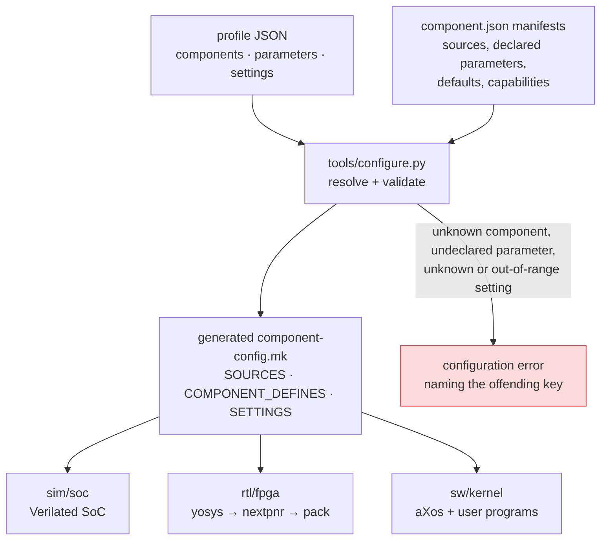

# Configurable component architecture

atomiX supports replacement at meaningful architectural seams while preserving
a simple route to the verified reference machine. The mechanism is intentionally
small: JSON manifests, standard-library Python, and generated Make variables.
There is no dependency solver, vendor framework, or custom HDL generator.

The catalog is in [`components/`](../components/README.md); supplied profiles
are in [`configs/`](../configs/). The resolver is:

```bash
python3 tools/configure.py list
python3 tools/configure.py resolve --config configs/sim-sdram.json
```

## What a configuration controls

A configuration selects CPU, SoC, fabric, memory, peripheral, board, and
simulation-harness components, with an optional `software` payload. The
supplied profiles select the reference versions, but every one can name a
built-in ID or an external manifest file. aXos has an independent
`KERNEL_CONFIG` profile for its scheduler, VM, allocator, shell, filesystem,
and block components. Custom component kinds such as `gpio` are also preserved
for a custom SoC or harness.

A profile carries two different kinds of knob, and the distinction is which
thing owns the value. **`parameters`** override a knob a *component* declares in
its own manifest, with its default and its documentation — the component owns
it, so a profile may only name what that component declared. **`settings`** are
system-level values no single component owns, such as `ram_bytes` or
`task_slots`; they are checked against the `SETTINGS` registry in
`tools/configure.py`. Both are validated: an unknown name, a wrong type, or an
out-of-range value is a configuration error naming the problem, not a silently
ignored line.



The three consumers spell the same defines differently — Verilator wants
`+define+NAME=VALUE`, the compilers want `-DNAME=VALUE` — so each converts. A
consumer that forgets to is the failure this flow is most prone to: the syscall
component's parameters were declared, documented and resolved for a long time
while `sw/kernel/Makefile` silently dropped them, so setting one changed
nothing and reported nothing.

`make sim CONFIG=configs/sim-delayed.json ...` composes a Verilated SoC;
`make fpga CONFIG=configs/ulx3s-85f.json` composes the ECP5 flow. Existing
directory-level build commands continue to work with their reference defaults.
`make software CONFIG=configs/sim-axos.json` delegates to the selected
software component's own build target and then boots its resulting images.
`make -C sw/kernel kernel-config KERNEL_CONFIG=../../configs/kernel-default.json`
shows the selected kernel services and policies.

## Reference adapters

`soc_top` now instantiates `axmem` rather than choosing BRAM, the delayed model,
or SDRAM itself. The default `axmem` delegates to `axmem_reference`, which
retains all prior behavior. A custom memory component can provide another
`axmem` module without modifying `soc_top`.

The same approach applies to the CPU and stock peripherals: a selected source
provides the module (`axcore`, `uart`, `clint`, or `axspi`) that the reference
SoC instantiates. The CPU boundary purposely excludes RVFI and rich trace
outputs; only the buses, interrupts, and minimal cache-maintenance trace are
connected. Users who need an incompatible interface should provide a custom
`soc_top` component instead of adding compatibility shims merely to satisfy a
catalog rule.

The aXos contract is intentionally smaller still. `scheduler_select` receives
the task states and returns a runnable slot; the kernel retains trap frames,
context switching, timer delivery, and syscall semantics. The selected VM
component owns only bootstrap mappings and per-task user address-space
creation/cloning/destruction through `vm.h`; kernel stacks remain kernel-owned.
`scheduler.cooperative` is an executable alternate policy, while `vm.sv32` is
the reference mapping implementation. A custom kernel is free to select none
of these and provide its own software build altogether.

The same source-selection model now covers the remaining SoC infrastructure
(`interconnect`, `cache`, `rom`, and `finisher`), the simulator `harness`, and
aXos service layers (`allocator`, `shell`, `filesystem`, and `block`). The
reference cache and `cache.passthrough` are both buildable selections. See the
[component map](component-map.md) for the complete inventory and the rule for
keeping implementation-private helpers out of the catalog.

## Verification posture

Selection proves composition, not correctness. The `core.pipeline5` manifest
is the implementation covered by the existing ISA, cosimulation, and formal
claims. An alternative core can be selected and built immediately, but it earns
those claims only by running appropriate evidence. This makes experimentation
easy without weakening the meaning of the reference project's verification.

`configs/sim-finisher.json` is an executable proof of that distinction. It
selects `core.finisher-smoke`, a tiny core that writes the simulation pass value
and nothing else. It validates source replacement and the thin stock boundary;
it is intentionally not evidence for RISC-V execution.

The same posture applies to `software`: `software.axos-sdboot` is the known
kernel payload, not an imposed operating system. A custom software manifest
may build another kernel, monitor, or entirely bare-metal program from outside
this repository. The hardware composition layer only receives the images and
runner mode it declares.

The reference `scheduler.round-robin` and `vm.sv32` together retain the
existing ISS/QEMU/RTL regression evidence. `make -C sw/kernel
kernel-component-test` runs that same evidence for both the reference and
cooperative scheduler profiles; a custom policy earns its own compatibility
claim by running a suitable test suite.
